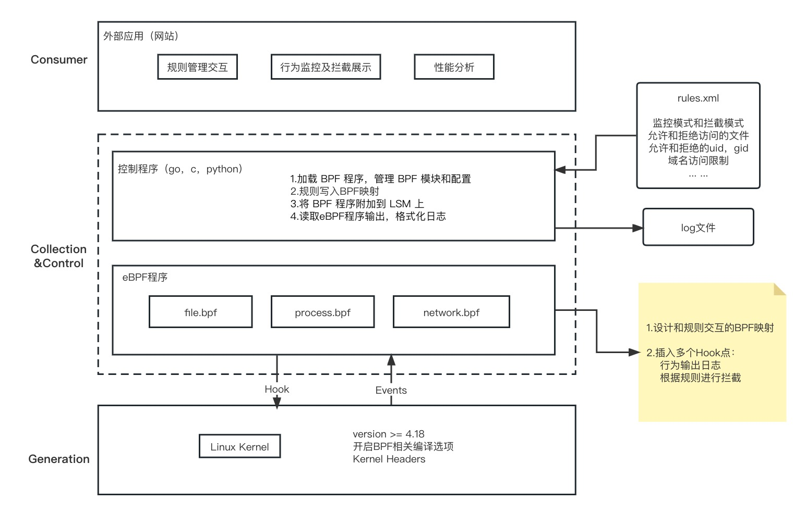
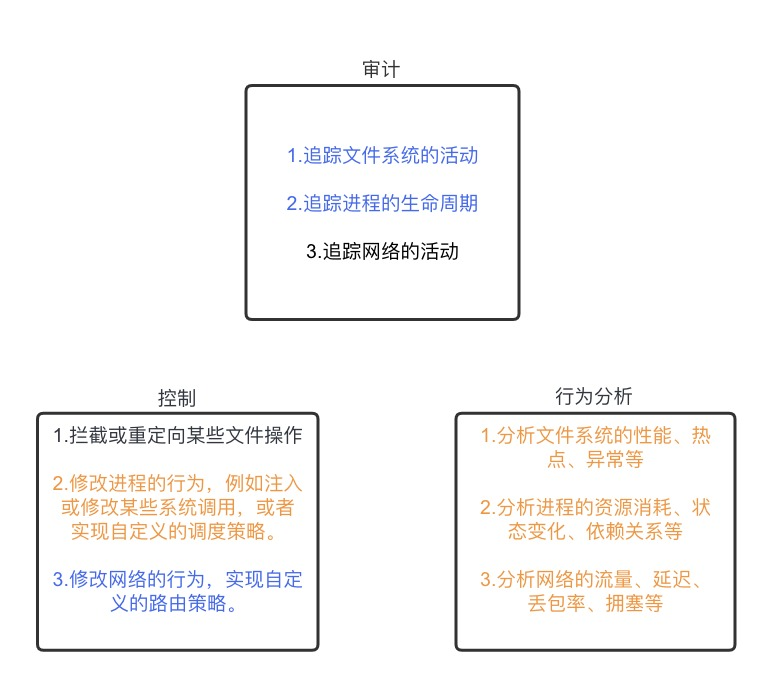

# safeguard: Linux security audit, control, and behavior analysis tools based on KRSI(eBPF+LSM)

针对操作系统、内核安全，safeguard是一个基于eBPF的Linux审计观测工具，可以实现文件，进程，网络操作的拦截及审计记录。项目采用libbpfgo库，使用go语言实现顶层控制

# 特性

* 审计：日志记录配置范围内的行为
* 控制：针对文件，进程，网络的安全访问控制
* 行为分析：收集信息，进行资源，热点，异常等分析



# 项目功能(部分位于开发阶段)

## 文件

- 追踪文件系统的活动，包括文件的打开、关闭、读写、删除等。


- 修改文件系统的行为，例如拦截或重定向某些文件操作，或者实现自定义的**安全策略**。

- 收集并分析文件系统的性能、热点、异常等。（选择合适的eBPF程序类型和挂载点，例如，使用kprobes或tracepoints来追踪文件系统相关的内核函数或事件，如vfs\_read, vfs\_write, ext4\_sync\_file等。）

    安全策略：

    1.  拦截或重定向某些文件操作，使用eBPF来拦截对敏感文件的读写操作，或者重定向对某些文件的访问到其他位置。
    2.  实现自定义的访问控制，使用eBPF来检查对文件的访问者的身份、权限、环境等信息，然后根据一些规则来允许或拒绝访问。
    3.  实现自定义的审计和监控，使用eBPF来记录对某些文件的操作的详细信息，如操作者、时间、内容等，并将这些信息输出到日志。

## 进程

- 追踪进程的生命周期，例如进程的创建、终止、调度、上下文切换等。
- 修改进程的行为，例如注入或修改某些系统调用，或者实现自定义的调度策略。
- 收集信息来分析进程的资源消耗、状态变化、依赖关系等（do\_fork, do\_exit, schedule等）。

## 网络

- 追踪网络的活动，例如网络包的发送、接收、转发、丢弃等。
- 修改网络的行为，例如过滤或重写某些网络包，或者实现自定义的路由策略。
- 收集信息，分析网络的流量、延迟、丢包率、拥塞等（使用tc或xdp来追踪网络包的发送、接收、转发、丢弃等事件）。

# 展望

优势：
轻量，灵活，生产安全

核心方向：
安全 ，KRSI

主要功能：
审计：日志记录监控范围内的行为
控制：针对文件，进程，网络的安全访问控制
行为分析：收集信息，进行资源，热点，异常等分析

信息采集后的分析处理，针对操作系统内核
访问禁止的文件列表，进程信息扫描

# 编译

```shell
$ git clone --recursive https://gitee.com/openeuler/safeguard.git && cd safeguard
# $ vagrant up && vagrant reload
# $ vagrant ssh

$ make libbpf-static
$ make build

$ sudo ./build/safeguard --config config/safeguard.yml #|grep BLOCK
```

# 开发路线


蓝色为部分完成，橙色待开发

# LICENSE

safeguard's userspace program is licensed under Apache License 2.0 License.  
eBPF programs inside [pkg/bpf directory](pkg/bpf) are licensed under [GNU General Public License version 2](./pkg/bpf/LICENSE.md).  
