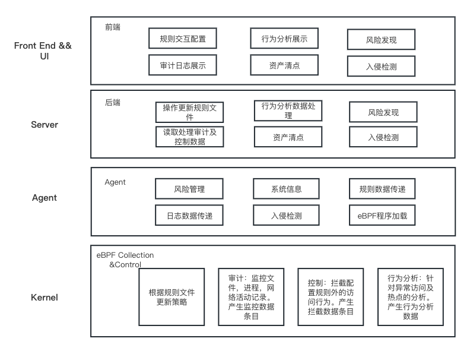

# safeguard: Linux security audit, control, and behavior analysis tools based on KRSI(eBPF+LSM)

针对操作系统、内核安全，safeguard是一个基于eBPF的Linux审计观测工具，可以实现安全操作的拦截及审计记录。项目采用libbpfgo库，使用go语言实现顶层控制

# 特性

* 审计：记录配置范围内的网络、文件、挂载和进程事件
* 控制：支持网络访问、文件访问、挂载和进程执行限制
* 策略：支持 monitor/block 模式，以及 host/container 作用范围
* 白名单：通过 controller 采集主机状态并生成白名单配置




# 编译
构建依赖和内核配置参考 [INSTALL.md](INSTALL.md)。先构建 libbpf，再构建 safeguard 二进制。

```shell
$ git clone --recursive https://atomgit.com/openeuler/safeguard.git && cd safeguard
# $ vagrant up && vagrant reload
# $ vagrant ssh

$ make libbpf-static
$ make build

$ sudo ./build/safeguard --config config/safeguard.yml
```

`config/safeguard.yml` 是源码树中的默认示例配置；临时验证可以使用自建配置文件，controller 生成的白名单配置通常使用 `whitelist.yaml`。

# 安装
从 AtomGit release 页面下载对应版本的 RPM 包：

```text
https://atomgit.com/openeuler/safeguard/releases
```

```shell
$ yum install ./safeguard-*.rpm
$ sudo safeguard --config /etc/safeguard/safeguard.yml
```

# Whitelist Policy

使用controller模块自动生成白名单配置：

```shell
# 生成白名单配置
$ sudo ./build/safeguard controller generate --output whitelist.yaml --report report.json

# 应用白名单配置
$ sudo ./build/safeguard --config whitelist.yaml
```

白名单模式配置示例：

```yaml
policy: whitelist  # blacklist(默认允许) 或 whitelist(默认阻断)

network:
  enable: true
  mode: block
  cidr:
    allow:
      - 127.0.0.1/8
      - 10.0.0.0/8
    deny: []

process:
  enable: true
  mode: block
  allow:
    - bash
    - python3
```

# configuration map
```shell
$ bpftool map update pinned /sys/fs/bpf/file_config key 00 00 00 00 value 01 00 00 00 00 00 00 00
```

# 项目功能

下面区分**已实现**的核心能力与仍在探索中的**规划方向**。规划方向仅作为设计意图记录,不一定在短期版本中落地;请勿在阅读时假设这些功能当前可用。具体平台支持矩阵见后续 [开发路线](#开发路线) 一节。

## 已实现

### 审计控制
文件:
- 通过 LSM hook 追踪文件系统的活动,包括打开、关闭、读写、删除等。
- 基于 allow/deny 路径前缀,在 block 模式下拦截匹配的文件访问(黑/白名单两种策略)。

进程:
- 通过 LSM hook 追踪进程执行(exec)与生命周期事件。

网络:
- 通过 sockaddr / connect 路径追踪并拦截出站 TCP 连接,结合域名解析结果做 CIDR 级别匹配。
- 通过 /proc/net 周期采样补充监听端口与已建立连接的快照。

挂载:
- 通过 LSM hook 追踪并拦截 `mount` 系统调用,基于 source 维度匹配策略。

### 主机管理
控制器(controller)从 /proc、/etc/passwd 与网络接口采集一次快照,自动生成可在 monitor / block 模式下使用的白名单基线,并输出基线对比报告。

## 规划与探索方向

以下条目描述的是设计意图或调研方向,当前代码**尚未实现**;实现细节、可行性与上线时间均未确定。

- 文件访问重定向、按身份/环境的细粒度访问控制、文件操作内容采集。
- 进程行为改写,例如系统调用注入、自定义调度策略。
- 网络包重写、自定义路由、基于 tc/xdp 的流量分析。
- 文件系统/进程/网络的性能、热点、延迟与拥塞等行为分析。
- 风险管理:漏洞检测、安全补丁、弱密码、系统与账号风险评估。
- 入侵检测:暴力破解、异常登录、反弹 shell、本地提权、持久化后门与 Web 后门。


# 开发路线

|           |                                     | 22.03 LTS SPx| 24.03 LTS | 24.03 SPx | 已实现 |
|-|-|:-:|:-:|:-:|:-:|
| 控制-主机规则设置 | 文件操作拦截                     |              |           |           | ✓    |
|                | 进程拦截（采用path hook）         | ✓            |           |           |  ✓   |
|                | 网络拦截                         |              |           |           |  ✓   |
| 主机管理      | 账号                              | ✓             |           |           |     |
|              | 端口                              | ✓             |           |           |     |
|              | 进程                              | ✓             |           |           |     |
| 风险管理      | 漏洞检测                           |               |           | ✓         |     |
|              | 安全补丁                          |                |           | ✓         |     |
|              | 弱密码                            |                |           | ✓         |     |
|              | 系统风险                          |                |           | ✓         |     |
|              | 账号风险                          |                |           | ✓         |     |
| 入侵检测      | 暴力破解                          |                | ✓         |           |     |
|             | 异常登录                           |                | ✓         |           |     |
|             | 反弹shell                         |                |           | ✓         |      |
|             | 本地提权                           |                | ✓         |           |      |
|             | 后门检测，Web后门                    |               |           | ✓         |      |
| 安全日志     | 审计日志：文件hook拦截方式由路径更改为inode | ✓          |           |           |  ✓   |
|             | 登录日志                           | ✓              |           |           |      |
|             | 账户变更日志                        |                | ✓         |           |      |
| 三权分立     | 三权分立                            |                |           |           |      |

# LICENSE

safeguard's userspace program is licensed under Apache License 2.0 License.  
eBPF programs inside [pkg/bpf directory](pkg/bpf) are licensed under [GNU General Public License version 2](./pkg/bpf/LICENSE.md).  
